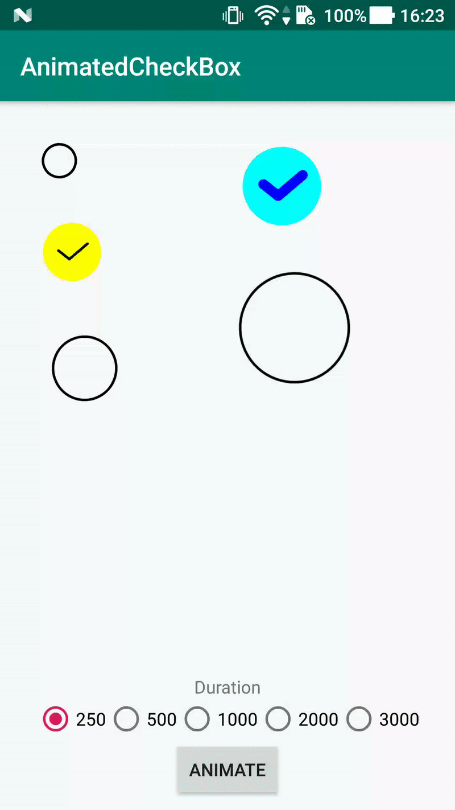

# AnimatedCheckBox

Custom CheckBox with animation (Kotlin)

### Example



## Usage
Add dependency into app build.gradle
```
implementation 'it.emperor.animatedcheckbox:animatedcheckbox:1.0.2'
```

If gradle failed to sync, try adding maven repository into project build.gradle
```
allprojects {
    repositories {
        maven {
            url  "https://dl.bintray.com/moro56/AnimatedCheckBox"
        }
    }
}
```

## Sample
See `app` module

#### Add AnimatedCheckBox into layout
```xml
<it.emperor.animatedcheckbox.AnimatedCheckBox
    android:id="@+id/animatedcheckbox"
    android:layout_width="60dp"
    android:layout_height="60dp"
    app:acb_animation_duration="500"
    app:acb_border_checked_color="#000"
    app:acb_border_checked_stroke_width="2dp"
    app:acb_border_not_checked_color="#0f0"
    app:acb_checked="true"
    app:acb_circle_color="#f00"
    app:acb_hook_color="#00f"
    app:acb_hook_stroke_width="2dp"
    app:acb_padding="10dp" />
```

#### Update state
To update the state of the checkbox (checked or not checked):
```kotlin
animatedCheckBox.setChecked(true, true) // animated
animatedCheckBox.setChecked(false) // not animated
```

#### Callback
To listen for the check changed events use:
```kotlin
animatedCheckBox.setOnChangeListener {
    println("Is checked: " + it) // true or false
}
```

#### Attributes
Name | Type | Description
--- | --- | ---
`acb_animation_duration` | Integer | The duration of the animation
`acb_border_checked_color` | Color | The color of the circle border (when checked)
`acb_border_checked_stroke_width` | Dimension | The stroke width of the circle border (when checked)
`acb_border_not_checked_color` | Color | The color of the circle border (when not checked)
`acb_checked` | Boolean | The state of the checkbox
`acb_circle_color` | Color | The color of the circle
`acb_hook_color` | Color | The color of the hook
`acb_hook_stroke_width` | Dimension | The stroke width of the circle (used for the circle border too (when checked))
`acb_padding` | Dimension | The padding of the view
`acb_ignore_animation` | Boolean | Don't animate the view when clicked

## License
```
Copyright 2017 Enrico Morotti

Licensed under the Apache License, Version 2.0 (the "License");
you may not use this file except in compliance with the License.
You may obtain a copy of the License at

http://www.apache.org/licenses/LICENSE-2.0

Unless required by applicable law or agreed to in writing, software
distributed under the License is distributed on an "AS IS" BASIS,
WITHOUT WARRANTIES OR CONDITIONS OF ANY KIND, either express or implied.
See the License for the specific language governing permissions and
limitations under the License.
```
